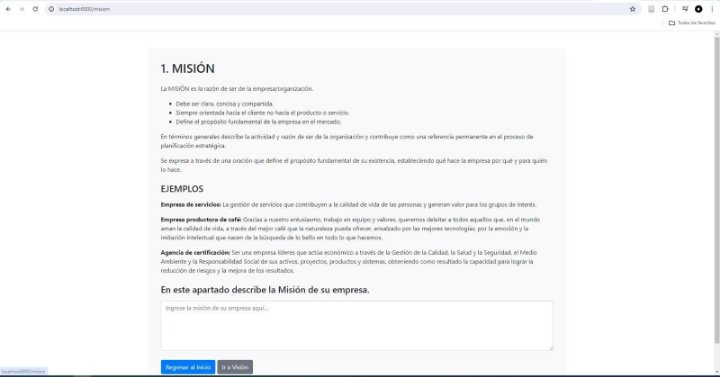
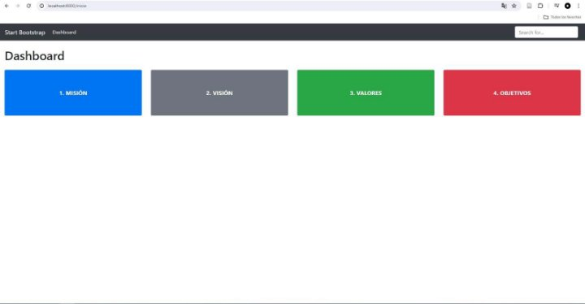
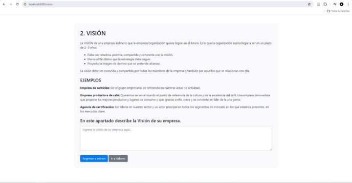
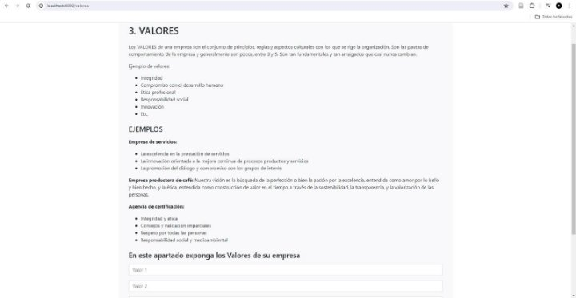

INTELIGENCIA ARTIFICIAL - UNIDAD II 

**INFORME DE AVANCE DE PROYECTO PETI** 

Docente: Dr. Oscar Jimenez Flores 

|Título del proyecto |**Sistema de Planeamiento Estratégico Municipalidad Distrital Crnl. Gregorio Albarracín Lanchipa (MD-CGAL)** |Fecha |**23/05/2024** |
| - | :- | - | - |

|Integrante |Código de estudiante |Correo electrónico |Rol o Función |
| - | - | - | - |
|Ccalli Chata, Joel Robert |2017057528 |jc2017057528@virtual.upt.pe |Programador / Analista de Base de datos|
|Llantay Machaca, Marjiory Grace |2020068951 |ml2020068951@virtual.upt.pe |Jefe de Proyecto / Programador|
|Ticahuanca Fiorela Milady |2020068765|ft2020068765@virtual.upt.pe |Documentador / Programador|
|Apaza Mamani, Edward Hernán |2018060915 |ft2020068765@virtual.upt.pe |Documentador / Programador|

ESTADO DEL PROYECTO ESTA SEMANA 

|Número de avance |Segundo avance |
| - | - |
|URL Github |https://github.com/edwardapaza/Proyecto\_Peti |
|% de Avance |40% |

RESUMEN 

Ingrese información aquí sobre el estado general y los aspectos más destacados del avance del proyecto en esta semana. 

En esta semana, hemos avanzado en la evaluación interna de nuestra cadena de valor, identificando los puntos fuertes y debilidades. El trabajo en equipo nos permite desarrollar nuestras capacidades y potenciar nuestras competencias, para implementar el Sistema de Planeamiento Estratégico.  

Diseño y Desarrollo del Sistema: Hemos diseñado y desarrollado un sistema basado en Python para facilitar la gestión eficiente del registro de usuarios y otras actividades administrativas. Este sistema se centra en la creación,  lectura,  actualización  y  eliminación  (CRUD)  de  registros,  así  como  en  la  gestión  de  tareas administrativas cruciales

Primer Avance: 

2do Avance: 

TRABAJO REALIZADO 

|**Tarea N°** |**Descripción de las actividades realizadas** |**Responsable** |
| :- | - | - |
|1 |Avance del análisis interno – Cadena de valor |Apaza Mamani, Edward Hernán|
|2 |Integración de las fortalezas y debilidades  |Ccalli Chata, Joel Robert|
|3 |Integración de las fortalezas y debilidades  |Llantay Machaca, Marjiory Grace|
|4 |Avance del análisis interno – Cadena de valor |Ticahuanca Fiorela Milady|

